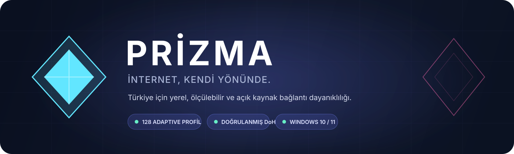

<p align="center">
  
</p>

<p align="center">
  <a href="https://github.com/Yoursel71/Prizma/releases/latest"></a>
  <a href="https://github.com/Yoursel71/Prizma/actions/workflows/prizma.yml"></a>
  <a href="LICENSE"></a>
  
</p>

<p align="center">
  <strong>Türkiye ağları için yerel, açık kaynak ve ölçülebilir bağlantı dayanıklılığı.</strong><br>
  Tek düğme. Kendi paket motoru. Ağınıza göre seçilen gerçek profil.
</p>

---

## Prizma nedir?

Prizma, Windows trafiğindeki DPI kaynaklı bağlantı bozulmalarına karşı geliştirilmiş minimalist bir masaüstü uygulamasıdır. Hazır bir komut dosyasını körlemesine çalıştırmak yerine, ağınızda **160 güvenli stratejiyi** sırayla ölçer; erişim, TLS gecikmesi ve küçük bir bant genişliği örneğine göre en uygun profili yerel olarak seçer.

`goodbyedpi.exe` veya `winws2.exe` çalıştırmaz. Projeye ait [.NET 8 paket motoru](src/Prizma.Engine/) WinDivert'e doğrudan bağlanır; incelenen açık kaynak DPI dayanıklılığı yaklaşımlarını tek, test edilebilir ve allowlist kontrollü bir hatta yeniden uygular.

> [!IMPORTANT]
> Prizma bağımsız bir topluluk projesidir; GoodbyeDPI, zapret veya WinDivert ile resmî bağlantısı yoktur. Ağ sonuçları operatöre, bölgeye ve zamana göre değişebilir. Yalnızca bulunduğunuz yerde yasal olan amaçlarla kullanın.

## Neden Prizma?

| Yerel motor | Adaptive profil laboratuvarı | Güvenli DNS hattı |
|---|---|---|
| Üçüncü taraf DPI motoru çalıştırmaz. C# kaynak kodu, argüman allowlist'i ve paket testleri bu depodadır. | 160 adayı aynı yaşam döngüsünde dener. Erişemeyen hızlı profil kazanamaz; önce doğruluk, sonra gecikme ve Mbps gelir. | Cloudflare wire-format DoH kullanır. Bootstrap IP sabittir; TLS sertifika adı ve zinciri hiçbir zaman devre dışı bırakılmaz. |

| Minimal Windows deneyimi | Hedefli paket işleme | Geliştirici görünürlüğü |
|---|---|---|
| Tek ekran, gerçek aç/kapat düğmesi, profil önerici ve isteğe bağlı otomatik başlayan Windows hizmeti. | TLS/HTTP akışları alan adı allowlist'iyle işlenebilir. QUIC engeli yalnız gereken profillerde kullanılır. | İlk 5 ölçüm, canlı motor günlükleri, aktif argümanlar, ping, Mbps, başarı oranı ve hata özeti tek ekrandadır. |

## Hızlı başlangıç

1. [En son sürümü indirin](https://github.com/Yoursel71/Prizma/releases/latest) ve ZIP'i çıkarın.
2. `Kur.cmd` dosyasını çalıştırın; Prizma `%ProgramFiles%\Prizma` altına kurulur.
3. Uygulamada **Önerilen profili bul** seçeneğini çalıştırın.
4. Turnuva tamamlandığında **Başlat** düğmesine basın.
5. Arayüz açık kalmasın istiyorsanız **Hizmet olarak kur** seçeneğini kullanın.

> [!TIP]
> Ağ veya modem değiştiğinde önericiyi yeniden çalıştırın. Prizma kazananı ağ parmak iziyle saklar ve başka ağın sonucunu evrensel profil gibi kullanmaz.

## Prizma Adaptive

```text
160 aday
   │
   ├── TLS split: 1 / 2 / alan adı ortası / çoklu split
   ├── sıra: ordered / reverse
   ├── fake: kapalı / wrong-sequence / wrong-checksum / hedefli TTL5 / TTL5+SEQ
   ├── QUIC: açık / kontrollü TCP fallback
   └── DNS: sistem / sertifika doğrulamalı DoH
            │
            ▼
  Roblox web + istemci CDN + API + gerçek zamanlı uçlar
            │
            ▼
  erişim → gecikme → Mbps → ilk 5 → bu ağın kazananı
```

Turnuva, kontrol hedefinin yanında Roblox ana sayfası, istemci ayar CDN'i, API, hesap ayarları ve gerçek zamanlı bağlantı uçlarını sınar. Her adaydan önce Windows DNS önbelleği temizlenir; motor durdurulup yeni argümanlarla tekrar başlatılır ve yeni HTTP bağlantı havuzu açılır. Toplam uygulama payload bütçesi **48 MB** ile sınırlıdır.

Sertifika adı/zincir hatası, DNS bütünlük hatası veya zorunlu hedeflerden birine erişememe adayı kazanan olmaktan çıkarır. Ayrıntılı tasarım: [Adaptive profil laboratuvarı](docs/ADAPTIVE.md).

## Motor yetenekleri

- TLS ClientHello'yu sabit konumlardan, SNI başlangıcından veya ikinci seviye alan adının ortasından bölme
- Çoklu sıralı split ve zapret yaklaşımından esinlenen ters sıralı `multidisorder` benzeri gönderim
- Geçmiş TCP sıra numaralı fake, tekrar/payload sınırı ve farklı IPv4 ID üretimi
- Hedefli TTL fake, hatalı checksum fake ve güvenli SNI maskeleme
- `Host` başlığını değiştirmeden HTTP parçalama; isteğe bağlı `hoSt` dönüşümü
- Cloudflare RFC 8484 wire-format DNS-over-HTTPS
- İsteğe bağlı QUIC/HTTP3 engeliyle kontrollü TCP/TLS fallback
- Alan adı son eki allowlist'i ve ilk ClientHello retransmit kesimi
- Fail-open davranışı: beklenmeyen paket işleme hatasında özgün paket geri gönderilir
- `ProcessStartInfo.ArgumentList` ile token bazlı süreç başlatma ve bilinmeyen argümanı reddeden CLI

## Mimari

```text
┌─────────────────────────────────────┐
│ Prizma.App                          │
│ Minimal WPF arayüz · Adaptive Lab   │
└──────────────────┬──────────────────┘
                   │ güvenli profil tokenları
┌──────────────────▼──────────────────┐
│ Prizma.Core                         │
│ Profil · benchmark · süreç · hizmet │
└──────────────────┬──────────────────┘
                   │ izole yerel süreç
┌──────────────────▼──────────────────┐
│ Prizma.Engine                       │
│ DNS · TLS/HTTP ayrıştırma · desync  │
└──────────────────┬──────────────────┘
                   │ P/Invoke
┌──────────────────▼──────────────────┐
│ WinDivert.dll + WinDivert64.sys     │
└─────────────────────────────────────┘
```

WinDivert teknik olarak ayrı `.dll` ve imzalı `.sys` dosyaları gerektirir. Paket bunun dışında GoodbyeDPI, zapret veya başka bir DPI aracının çalıştırılabilir dosyasını içermez.

## Yerleşik profiller

| Profil | Yaklaşım | Kullanım |
|---|---|---|
| **Türkiye · Ana** | Split=2, native reverse, hedefli TTL5, DoH; QUIC açık | Genel başlangıç |
| **Türkiye · Uyumluluk** | Sıralı split=2 + SNI, fake ve özel DNS kapalı | En az müdahale |
| **Türkiye · Güçlü** | Çoklu reverse, hedefli TTL5+SEQ ve TCP fallback | Son çare / agresif ağ |
| **Türkiye · Roblox** | `roblox.com`, `rbx.com`, `rbxcdn.com` hedefli klasik reçete | Yalnız Roblox trafiği |
| **Bu ağ için önerilen** | 160 adaydan yerel ölçümle seçilir | Tercih edilen seçenek |

## Windows hizmeti

**Hizmet olarak kur**, seçili profili `%ProgramData%\Prizma` altına atomik olarak kopyalar ve `Prizma.Engine` hizmetini otomatik başlangıçla kaydeder. GUI kapalıyken de çalışır. Profil değiştirmek için hizmeti kaldırıp yeni profille yeniden kurun; iki paket motorunun aynı anda çalışmasına izin verilmez.

## Kaynaktan derleme

Gereksinimler: Windows 10/11 x64, .NET 8 SDK ve PowerShell 5.1 veya 7+.

```powershell
dotnet restore Prizma.sln
dotnet build Prizma.sln --configuration Release
dotnet test Prizma.sln --configuration Release
./scripts/Build-Release.ps1 -Version 1.3.0
```

Paketleme betiği yalnız resmî WinDivert `v2.2.2` arşivini indirir ve sabit `63cb41763bb4b20f600b6de04e991a9c2be73279e317d4d82f237b150c5f3f15` SHA-256 özetiyle doğrular. Self-contained `win-x64` çıktı `artifacts/release/` altında oluşturulur.

## Bilinçli sınırlar

- Motor şu an IPv4 TCP 80/443 ve IPv4 UDP DNS trafiğini işler.
- IPv6 DNS ve birden fazla TCP paketine yayılan TLS ClientHello reassembly henüz yoktur.
- QUIC paketi sahteleştirilmez; yalnız güçlü profillerde UDP/443 kontrollü olarak düşürülür.
- Alan adı filtresi ilk HTTP isteği veya TLS ClientHello üzerinden çalışır; genel amaçlı VPN değildir.
- WinDivert üçüncü taraf dinamik bağımlılıktır.
- Erken geliştirme paketleri kod imzalı değildir; yalnız bu deponun Releases sayfasından indirin.

## Kaynak, güvenlik ve lisans

Tasarım; [GoodbyeDPI-Turkey](https://github.com/cagritaskn/GoodbyeDPI-Turkey/tree/02fee64e1e44759b38aa4b05a46f8bcedaa3bec8), [ValdikSS/GoodbyeDPI](https://github.com/ValdikSS/GoodbyeDPI), [bol-van/zapret2](https://github.com/bol-van/zapret2) ve [hufrea/byedpi](https://github.com/hufrea/byedpi) projelerinin belgelenmiş yaklaşımları incelenerek C#'ta yeniden uygulanmıştır. Üçüncü taraf motor kaynakları projeye kopyalanmaz ve onların çalıştırılabilir dosyaları dağıtılmaz.

- Proje lisansı: [MIT](LICENSE)
- Üçüncü taraf bildirimleri ve sabitlenmiş kaynaklar: [NOTICE.md](NOTICE.md)
- Güvenlik politikası: [SECURITY.md](SECURITY.md)
- Sürüm notları: [CHANGELOG.md](CHANGELOG.md)

<p align="center">
  <strong>PRİZMA</strong><br>
  <sub>Bağlantıyı tahmin etmez. Ölçer.</sub>
</p>
